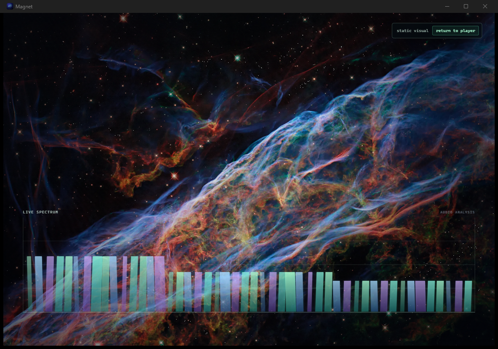

# Magnet

A Windows-first Spotify desktop client with a dense, keyboard-forward library UI and a restrained reactive visual layer.



> **First click:** download the current Windows installer from [Releases](https://github.com/haidmoham/magnet/releases), install it, then choose **connect Spotify** in Magnet. Your browser completes the one-time authorization and the app restores that session on later launches.

## First launch

1. Download and run the Windows installer from [Releases](https://github.com/haidmoham/magnet/releases). This is an alpha build; Windows may show the usual unsigned-app warning.
2. Open Magnet and click **connect Spotify**. Sign in and approve the browser prompt, then return to the app.
3. Let the library finish loading. Double-click a track to play it; single-click a playlist to open it and double-click the playlist to start it.

Magnet needs Spotify Premium for native playback. It stores the refresh token in Windows Credential Manager, not in the repository or the app’s catalog cache.

## Current alpha shell

The repository contains the packaged Tauri desktop shell, the WebGL visual layer, wallpaper-backed static visual end state, interaction model, adaptive quality controller, local preferences, diagnostics export, and a typed Rust/TypeScript bridge. Spotify credentials and the librespot/ncspot data core are deliberately isolated behind that bridge.

## Development

```powershell
npm install
npm run tauri dev
```

## Releases

Every `v*` Git tag builds the NSIS installer on a clean Windows GitHub Actions runner and attaches it to the matching GitHub Release. The installer is always regenerated from the tagged commit; binaries are not checked into this repository.

## Product constraints

- No external visual website is a dependency.
- Visual controls are intentionally limited to visuals, intensity, and quality.
- The physics-inspired visual layer is an intentional performance tradeoff: it
  must respond to decoded audio, retain a wallpaper-backed static end state,
  and never be used to excuse sluggish interaction.
- New product scope stays atomic and deliberate. Prefer a specific music-player
  capability that earns its place in the keyboard-forward flow over broad
  preference surfaces or feature accumulation.
- Playback must use a dedicated Spotify app identity and a Premium account.
- No analytics or remote telemetry are included.

## Third-party lineage

The production Spotify core will adapt selected components from [ncspot](https://github.com/hrkfdn/ncspot), which is BSD-2-Clause licensed. See `NOTICE` before importing or shipping adapted source.
