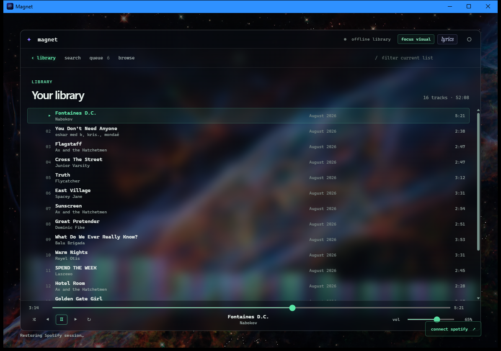

# Magnet

A lightweight Windows Spotify client with a dense, keyboard-forward library
and a static space-artwork layer.



> **Get started:** [download the Windows installer](https://github.com/haidmoham/magnet/releases), install it, then select **connect Spotify** in Magnet. Authorization completes in your browser once; later launches restore the saved session.

## What it does

- Plays Spotify through the native desktop player (Spotify Premium required).
- Loads your saved tracks and playlists, with Spotify-wide track and playlist search.
- Keeps a manipulable queue: add, reorder, remove, or clear tracks without leaving the player.
- Pairs the library UI with real space imagery, a live spectrum histogram, and a foreground-free visual view.
- Keeps control surfaces intentionally small: image selection and visual mode.

## First launch

1. Download and run the installer from [Releases](https://github.com/haidmoham/magnet/releases). This is an unsigned alpha build, so Windows may show its standard warning.
2. Open Magnet and choose **connect Spotify**. Sign in and approve the browser prompt, then return to the app.
3. Let the library finish loading. Single-click a playlist to open it; double-click one to start it. Double-click a track to play it.

Magnet stores its Spotify refresh token in Windows Credential Manager, not in the repository or catalog cache. No analytics or remote telemetry are included.

## Visuals

Magnet uses static NASA/Hubble artwork as its visual layer. The spectrum responds to decoded playback audio, while the image stays still; visual mode can hide the foreground entirely. Playback and library interactions remain the product's priority.

## Development

```powershell
npm install
npm run tauri dev
```

## Releases

Every `v*` Git tag builds an NSIS installer on a clean Windows GitHub Actions runner and attaches it to the matching GitHub Release. Installers are generated from their tagged commit; binaries are not checked into this repository.

## Credits

Magnet uses the Spotify desktop-client ecosystem, including selected architectural lineage from [ncspot](https://github.com/hrkfdn/ncspot) (BSD-2-Clause). See [NOTICE](NOTICE) for attribution and licensing detail.
